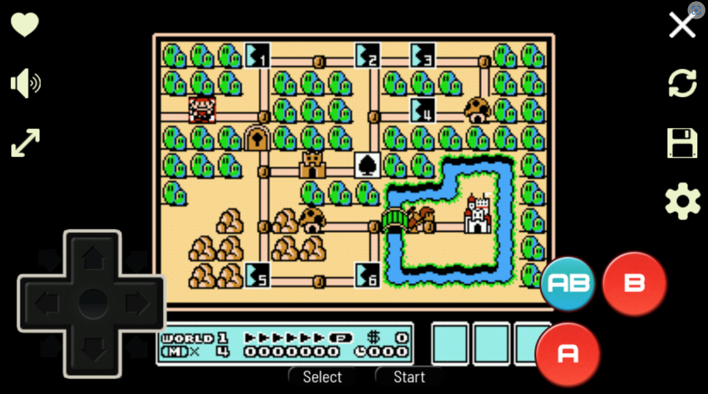

# NEStalgia

nostalgia: a feeling of sentimental longing or wistful affection for the NES - NEStalgia is an experimental NES emulator

Welcome to NEStalgia, a NES emulator that lets you relive the classic gaming experience of the Nintendo Entertainment System. With NEStalgia, you can play your favorite NES games on your computer, complete with authentic graphics and sound. NEStalgia is easy to use, with a simple and intuitive interface that lets you load ROMs, save and load your game progress, and customize your controller settings. Whether you're a longtime fan of the NES or just discovering these classic games for the first time, NEStalgia is the perfect emulator to bring your favorite titles to life. So why wait? Download NEStalgia today and start playing your favorite NES games like never before!